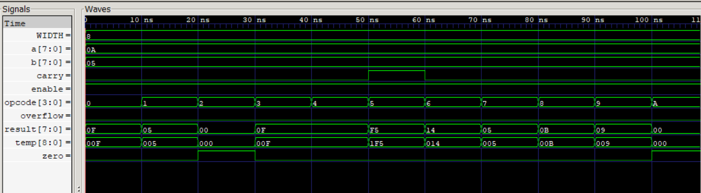

# 🔷 Verilog ALU Design (Industry-Oriented)

## 📌 Overview

This project implements a parameterized Arithmetic Logic Unit (ALU) using Verilog HDL.
It supports multiple arithmetic, logical, and comparison operations with basic low-power optimization.

---

## ⚙️ Features

* Parameterized data width
* Arithmetic operations (ADD, SUB, INC, DEC)
* Logical operations (AND, OR, XOR, NOT)
* Shift operations
* Comparison operation
* Flag generation (Zero, Carry, Overflow)
* Low-power design using enable signal (operand isolation)

---

## 🔢 Opcode Mapping

| Opcode | Operation   |
| ------ | ----------- |
| 0000   | ADD         |
| 0001   | SUB         |
| 0010   | AND         |
| 0011   | OR          |
| 0100   | XOR         |
| 0101   | NOT         |
| 0110   | SHIFT LEFT  |
| 0111   | SHIFT RIGHT |
| 1000   | INC         |
| 1001   | DEC         |
| 1010   | COMPARE     |

---

## 🧪 Simulation

* Tool: Icarus Verilog + GTKWave
* Verified all operations and edge cases
* Included overflow and zero condition testing
* Low-power behavior validated using enable signal

---

## 📸 Output Waveform

---

## 🧠 Design Insight

This is a combinational ALU design. In real-world processors, ALUs are integrated into pipelined datapaths with timing and power optimization.

---

## 🚀 Future Improvements

* Pipeline integration
* Clock gating for power optimization
* ASIC synthesis and timing analysis
* Advanced verification (SystemVerilog)

---

## 👩‍💻 Author

Nidhi Apotikar
